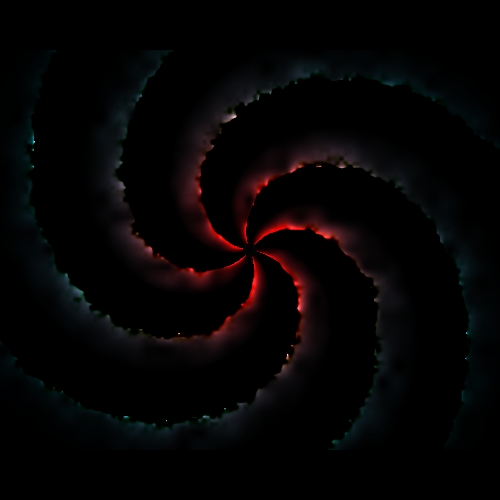

# Nygori

Nygori is a collection of GLSL shaders I've produced. They are best enjoyed with
[glslviewer](https://github.com/patriciogonzalezvivo/glslViewer).

The name nygori is a portmaneu of nyans (Swedish for shade) and allegori
(Swedish for allegory). The name is meant to represent the graphical aspects of
shaders and also reference Plato's cave allegory.

## Usage

```fish
$ git clone https://github.com/karlek/nygori.git
$ cd nygori/julia
$ glslViewer julia.frag
```

## Screenshots


